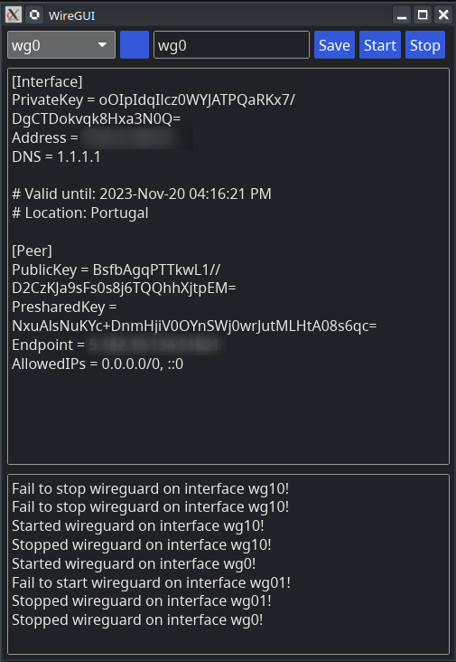

# WireGUI

WireGUI is a lightweight GUI for wireguard VPN Client, allowing you to create/edit wireguard config files and start stop 
wireguard. WireGUI have been tested under linux only, but should be port easily to other OS.



WireGUI should be run as `root` or with `sudo` command.

## Build

You should build WireGUI by yourself, you need to have the [rust toolsuite](https://www.rust-lang.org/tools/install) installed.

then just run 
```
cargo build --release
```

You should then find `wiregui` binary in `target/release/` directory, then you can copy it to `/usr/bin` using this command:

``` 
sudo cp ./target/release /usr/bin/wiregui
```

## Dependencies

`wiregard` and `resolvconf` are  needed:

``` 
sudo apt install wireguard resolvconf
```


## Run

Just launch it from a terminal as root or with sudo:

``` 
sudo wiregui
```